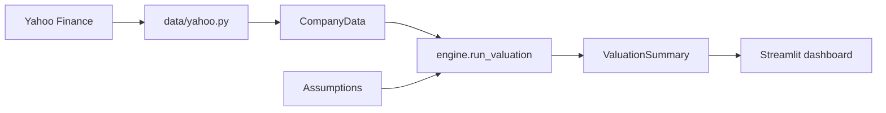

# 📈 Stock Valuation System

A modular equity-valuation workbench. It pulls live fundamentals from Yahoo
Finance and values a stock with six complementary methods, then blends them
into a single fair value and a BUY / HOLD / SELL call.

Built around the core corporate-finance toolkit: CAPM/WACC, DCF, dividend
discount models, market multiples, peer comparables, and sensitivity/scenario
analysis.

---

## Features

| Model | Module | What it does |
|-------|--------|--------------|
| **CAPM & WACC** | `valuation/capm.py` | Cost of equity (`rf + β·ERP`) and market-value-weighted WACC |
| **DCF – FCFF** | `valuation/dcf.py` | Enterprise DCF → equity value via net debt |
| **DCF – FCFE** | `valuation/dcf.py` | Equity DCF discounted at the cost of equity |
| **DDM – Gordon** | `valuation/ddm.py` | Constant-growth dividend discount |
| **DDM – Multi-stage** | `valuation/ddm.py` | High-growth phase + Gordon terminal value |
| **Multiples** | `valuation/multiples.py` | P/E, EV/EBITDA, P/B implied prices |
| **Comparables** | `valuation/comparables.py` | Peer-median multiples benchmarking |
| **Sensitivity / Scenarios** | `valuation/sensitivity.py` | WACC × g heat-map, Bear/Base/Bull |
| **🤖 AI Analyst** | `valuation/ai_analyst.py` | Institutional equity research with trend, seasonal & growth analysis |

### AI Analyst Features (20+ Years Institutional Expertise)

The **AI Analyst** tab provides deep institutional-grade analysis:

- **Growth Trajectory Analysis**: Historical CAGR, recent growth rates, momentum analysis (accelerating/decelerating), and growth quality assessment
- **Seasonal Pattern Detection**: Identifies seasonal revenue patterns in business models with coefficient-of-variation analysis and typical peak/trough quarters by sector
- **Market Trend Classification**: Categorizes stocks as GROWTH, MOMENTUM, VALUE, CYCLICAL, or DECLINING with confidence levels based on growth metrics and valuations
- **Investment Thesis Generation**: Creates comprehensive analyst-style theses including:
  - Executive summary with institutional perspective
  - Bull and bear cases with supporting rationale
  - Key catalysts and risks
  - Valuation assessment and growth outlook
  - Competitive positioning analysis
  - Analyst conviction levels
- **Sector-Aware Analysis**: Customized seasonal patterns and trend drivers by industry (Technology, Retail, Manufacturing, Agriculture, Consumer, etc.)


> **Automatic peer discovery:** just enter a ticker — peers are found
> automatically from the company's Yahoo *industry* (then *sector* as a
> fallback). You can still override them manually in the sidebar.

> **🇮🇳 Indian stocks supported:** enter a bare NSE symbol (`RELIANCE`, `TCS`,
> `INFY`) and it auto-resolves to `.NS` (then `.BO`); or pass an explicit
> symbol (`RELIANCE.NS`, `500325.BO`). Values render in ₹, the risk-free rate
> and equity-risk-premium defaults switch to Indian levels (~6.8% / 7%), and
> peers are matched to the **same market** (Indian targets get Indian peers,
> with a curated NSE fallback by sector).

---

## Architecture

```
app.py                      Streamlit dashboard (UI only)
src/stockval/
├── config.py               Default market & DCF assumptions
├── models/__init__.py      Domain dataclasses (CompanyData, ValuationResult…)
├── utils.py                Pure numerical helpers (PV, Gordon TV, CAGR…)
├── engine.py               Orchestrates all models → ValuationSummary
├── data/
│   └── yahoo.py            The ONLY place that touches the network (yfinance)
└── valuation/
    ├── capm.py  dcf.py  ddm.py
    ├── multiples.py  comparables.py  sensitivity.py
    └── ai_analyst.py       AI-powered institutional equity analysis
tests/                      Offline unit tests (no network needed)
```

**Design principle:** the valuation core is *pure* (no I/O). All external
data access is isolated in `data/yahoo.py`, so every engine is deterministic
and unit-testable offline.



---

## Getting started

```powershell
# 1. Install dependencies
pip install -r requirements.txt

# 2. Launch the dashboard
streamlit run app.py
```

Then enter a ticker (e.g. `AAPL`), optionally some peer tickers, and click
**Run valuation**. Tune the assumptions in the sidebar to see fair values,
the sensitivity heat-map, scenarios and comparables update live.

### Use as a library

```python
from stockval.data.yahoo import fetch_company
from stockval.engine import derive_assumptions, run_valuation

company = fetch_company("MSFT")
assumptions = derive_assumptions(company)      # seeded from the company's data
summary = run_valuation(company, assumptions)

print(summary.blended_fair_value, summary.recommendation())
for r in summary.results:
    print(r.method, r.fair_value_per_share)
```

### Discover peers programmatically

```python
from stockval.data.yahoo import fetch_company, discover_peers

company = fetch_company("AAPL")
peers = discover_peers(company, max_peers=6)    # auto from industry/sector
```

### Indian stocks

```python
from stockval.data.yahoo import resolve_ticker, fetch_company, discover_peers

symbol = resolve_ticker("RELIANCE")             # -> "RELIANCE.NS"
company = fetch_company(symbol)                  # currency = INR
peers = discover_peers(company, max_peers=5)     # Indian (NSE) peers only
```

---

## Testing

```powershell
pytest -q
```

The suite runs fully offline using a synthetic company fixture
(`tests/conftest.py`) and validates each formula against hand-computed values.

---

## Key formulas

$$k_e = r_f + \beta \,(r_m - r_f) \qquad WACC = \tfrac{E}{V}k_e + \tfrac{D}{V}k_d(1-t)$$

$$FCFF = EBIT(1-t) + D\&A - CapEx - \Delta WC$$

$$V_0 = \sum_{t=1}^{N}\frac{CF_t}{(1+r)^t} + \frac{CF_N(1+g)}{(r-g)(1+r)^N}$$

---

> ⚠️ **Disclaimer:** This is an educational tool. Outputs are only as good as
> the assumptions and third-party data behind them. Not investment advice.
